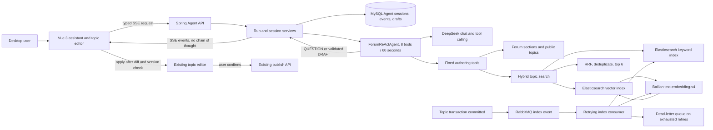
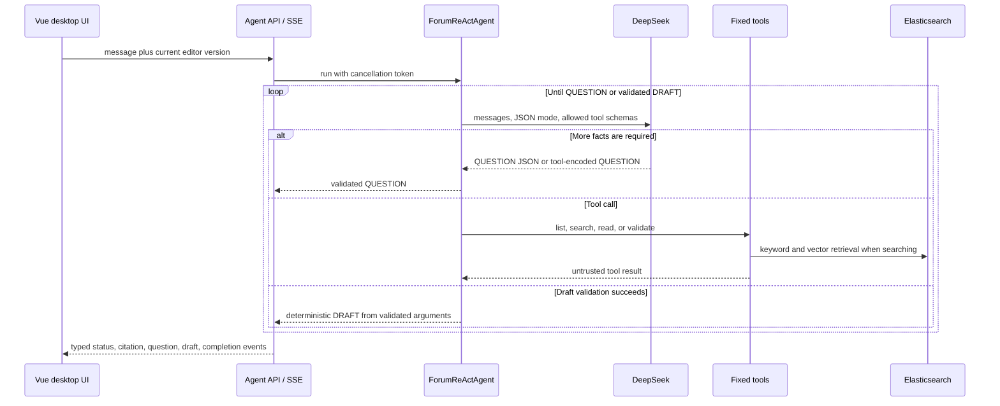

# Forum Authoring Agent Architecture

## Request And Indexing Paths

## Agent Sequence

## Design Decisions

- The model sees only visible public-topic content. Hidden topics, comments,
  campus records, and images are excluded.
- Keyword and vector retrieval each request 20 hits. Reciprocal Rank Fusion
  merges them, deduplicates by topic, and returns six references. Keyword-only
  fallback remains available when embedding/vector search is unavailable.
- Tool output is untrusted prompt data. The system prompt forbids following
  historical instructions, disclosing hidden prompts/reasoning, or claiming a
  post was published.
- DRAFT fields are taken from a successful production `validate_draft` call.
  The runtime also normalizes provider-specific QUESTION tool encoding and can
  revalidate a corrected strict terminal draft without relaxing validation.
- Cancellation and every model/tool operation share one hard 60-second budget.
  Tool calls, including runtime revalidation, share the same limit of eight.
- SSE exposes status and results, never the model's private reasoning content.
- Editor versions prevent a stale Agent result from overwriting later user
  edits. Markdown is sanitized before conversion to Quill Delta; existing
  images stay in the editor and are not sent for model analysis.
- Publishing remains outside the Agent boundary and always requires a user
  action through the existing forum endpoint.
